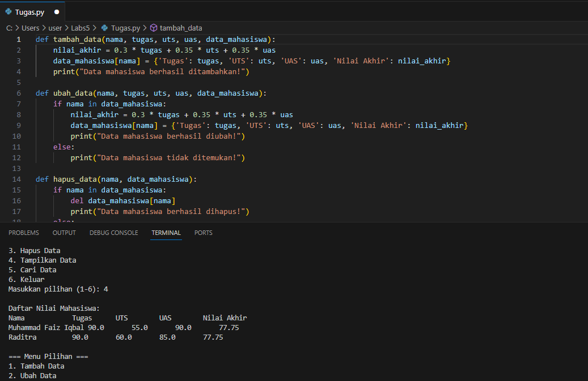

# Praktikum_6
## Installation environmet virtual(venv) & Deactivate di visual studio code
- python - m venv praktikum3
- for activate praktikum3/Scripts/activate
- deactivate
## command 
 - git add dapat digunakan secara spesifik untuk file tertentu atau direktori, memberikan Anda fleksibilitas untuk memilih perubahan mana yang akan dimasukkan dalam staging 
  area.
 - git commit -m “hi” Untuk menyimpan perubahan yang ada kedalam database repository local
 - git remote add origin https://github.com/faiziqbal1201/Praktikum_6 Remote Repository merupakan repository server yang akan digunakan untuk menyimpan setiap perubahan pada 
   local repository, sehingga dapat diakses oleh banyak user.
 - git push -u origin master/main Untuk mengirim perubahan pada local repository ke server gunakan perintah git push.
 - git clone [url] Clone repository, pada dasarnya adalah meng-copy repository server dan secara otomatis membuat satu direktory sesuai dengan nama repositorynya (working 
   directory).
## LATIHAN
  1. Membuat Dictionary Daftar Kontak
  Membuat dictionary daftar_kontak yang berisi nama-nama sebagai kunci dan nomor telepon sebagai nilai.
  2. Menampilkan Kontak Ari
  Menggunakan metode 'get' untuk menampilkan nomor telepon Ari, dan jika tidak ditemukan, menampilkan pesan "Kontak tidak ditemukan".
  3. Menambah Kontak Baru Riko
  Menambahkan kontak baru, Riko, ke dalam dictionary.
  4. Mengubah Kontak Dina dengan Nomor Baru
  Mengubah nomor telepon untuk kontak Dina.
  5. Menampilkan Semua Nama
  Menampilkan daftar semua nama dalam bentuk list.
  6. Menampilkan Semua Nomor
  Menampilkan daftar semua nomor telepon dalam bentuk list.
  7. Menampilkan Daftar Nama dan Nomornya
  Menggunakan loop for untuk menampilkan semua pasangan nama dan nomor dalam dictionary.
  8. Menghapus Kontak Dina
  Menghapus kontak Dina dari dictionary.
  9. Menampilkan Daftar Nama dan Nomornya Setelah Penghapusan
  Menampilkan daftar nama dan nomor setelah kontak Dina dihapus.
## OUTPUT

## PRAKTIKUM
1. tambah_data(nama, tugas, uts, uas, data_mahasiswa):
Menerima input nama, nilai tugas, UTS, dan UAS mahasiswa.
Menghitung nilai akhir dengan bobot tertentu.
Menambahkan data mahasiswa ke dalam dictionary data_mahasiswa.

2. ubah_data(nama, tugas, uts, uas, data_mahasiswa):
Memeriksa apakah nama mahasiswa sudah ada di dalam data_mahasiswa.
Jika ada, menghitung nilai akhir baru dan mengubah data mahasiswa yang bersangkutan.

3. hapus_data(nama, data_mahasiswa):
Memeriksa apakah nama mahasiswa sudah ada di dalam data_mahasiswa.
Jika ada, menghapus data mahasiswa yang bersangkutan.

4. tampilkan_data(data_mahasiswa):
Menampilkan daftar nilai mahasiswa yang ada dalam format tabel.

5. cari_data(nama, data_mahasiswa):
Mencari data mahasiswa berdasarkan nama.
Jika ditemukan, menampilkan data mahasiswa tersebut.

6. Program Utama:
Terdapat dictionary data_mahasiswa yang digunakan untuk menyimpan data mahasiswa.
Program utama berupa loop while True yang menampilkan menu pilihan kepada pengguna.
Pengguna diminta memasukkan pilihan (1-6) sesuai dengan operasi yang diinginkan.

Menu Pilihan:
1. Tambah Data (Pilihan 1):
Meminta input nama dan nilai mahasiswa.
Memanggil fungsi tambah_data untuk menambahkan data mahasiswa.

2. Ubah Data (Pilihan 2):
Meminta input nama mahasiswa yang ingin diubah dan nilai baru.
Memanggil fungsi ubah_data untuk mengubah data mahasiswa.

3. Hapus Data (Pilihan 3):
Meminta input nama mahasiswa yang ingin dihapus.
Memanggil fungsi hapus_data untuk menghapus data mahasiswa.

4. Tampilkan Data (Pilihan 4):
Memanggil fungsi tampilkan_data untuk menampilkan seluruh data mahasiswa.

5. Cari Data (Pilihan 5):
Meminta input nama mahasiswa yang ingin dicari.
Memanggil fungsi cari_data untuk mencari dan menampilkan data mahasiswa.

6. Keluar (Pilihan 6):
Menampilkan pesan bahwa program selesai dan mengakhiri loop

Program ini menyediakan fungsionalitas dasar untuk manajemen data mahasiswa, termasuk menambahkan, mengubah, menghapus, menampilkan, dan mencari data mahasiswa. Program dapat diulang dengan memilih menu atau diakhiri dengan memilih opsi keluar
## OUTPUT
